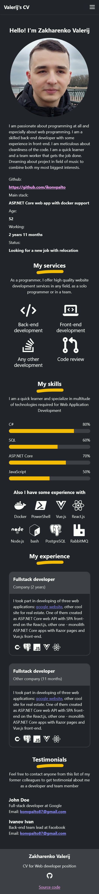
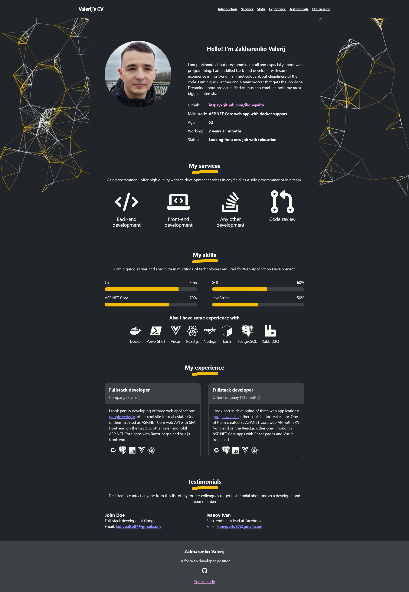

# cv-template

Template for cv website

## How to use

You need to do next things:
1. Fill [src/data/person.json](src/data/person.json) with you data.
2. For all new technologies and services ensure that there are exist corresponding svg icon in [src/raw_resources/svgs/icons](src/raw_resources/svgs/icons) folder and mapping in [src/data/icons_mapping.json](src/data/icons_mapping.json) file.
3. Add your photo in [src/raw_resources/images](src/raw_resources/images) folder as avatar.jpg.
4. Run `npm ci && npm run start`
5. Open your site in Google Chrome and print page to pdf with *Background graphics* flag set (More options -> background graphics) as src/web_page/cv.pdf file
6. Stop `npm run start` command and run `npm run build`

After this steps your cv will be fully prepared and placed in dist folder.

## Requirements

Node.js ^16.0.0 (Working on 16.19.0)

## Todo

1. Provide deploy scripts and nginx configs
